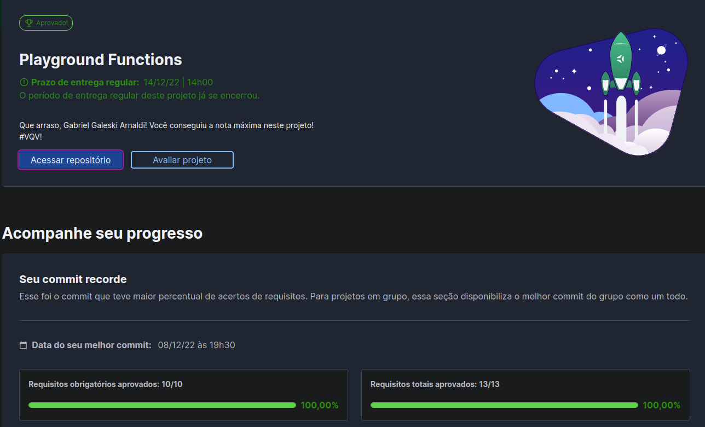

# :notebook_with_decorative_cover: Playground Functions!

 

# :clipboard: About

O projeto tinha como objetivo a resolução de problemas logicos de JavaScript, utilizando funções e ferramentas complementares que desenvolviam a logica.

 

# :hammer_and_wrench: Skills & Tools

- JavaScript ES6
